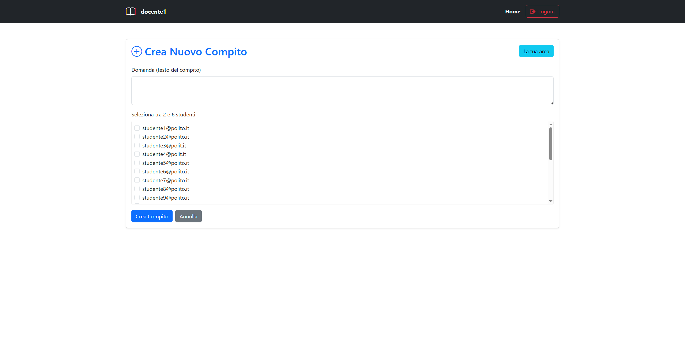
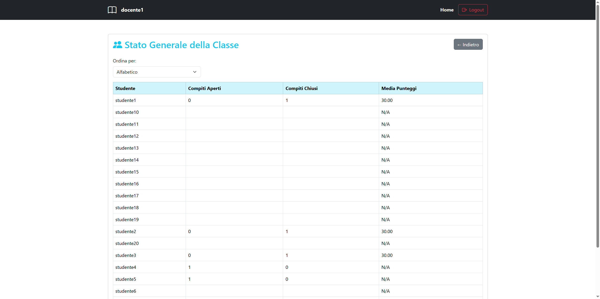

## "Compiti"
## La seguente web app può essere utilizzato con nodemon
# Descrizione:
La web app sviluppata è stata creata per un esame del corso di Applicazioni Web I del Politecnico di Torino. Utilizza CORS per una riproduzione in locale tramite 2 diversi indirizzi che possono essere modificati, l'utilizzo in simultanea di più profili può avvenire se si utilizza una scheda del browser in incognito ed una con un utilizzo classico, altre librerie utilizzate sono: bootstrap, bootstrap-icons, react, react-bootstrap, react-dom, react-router-dom, vite, eslint, morgan, express, express-session, express-validator, sqlite3, ed altre che potete trovare nei file package.json di client e server.

## React Client Application Routes

- Route `/`: Hompage iniziale, scelta tra area studente e area docente, login, pulsante per tornare alla propria area se già loggati.
- Route `/login-studente`: route protetta accessibile solo da studenti, pagina di autentificazione con login form per studenti registrati. Se si è loggati con un altro utente appare un pulsante per il logout.
- Route `/login-docente`: route protetta accessibile solo da docenti, pagina di autentificazione con login form per docenti registrati. Se si è loggati con un altro utente appare un pulsante per il logout.
- Route `/studente` : route protetta accessibile solo da studenti, mostra compiti aperti, invio/modifica risposta solo dopo aver selezionato un compito aperto, accesso alle valutazioni.
- Route `/studente/valutazioni`: route protetta accessibile solo da studenti, mostra l'elenco delle valutazioni ricevute e la media pesata.
- Route `/docente` : route protetta accessibile solo da docenti, accesso alla creazione di un compito, compiti aperti da valutare e lo stato della classe.
- Route `/docente/crea-compito`: route protetta accessibile solo da docenti, form per creare un nuovo compito e selezionare il gruppo.
- Route `/docente/compiti/:compitoId/valuta`: route protetta accessibile solo da docenti, pagina per inserire la valutazione di un compito.
- Route `/docente/classi`: route protetta accessibile solo da docenti, mostra la tabella con lo stato generale della classe, ordinabile.

## API Server

#### POST `/api/sessions`
**Purpose:** Login utente e creazione della sessione  
- **Request body:** `{ "username": "string", "password": "string" }`
- **Response (201):** `{ "id": number, "username": "string", "email": "string" }`
- **Response (401):** `{ "message": "Credenziali non valide" }`
- **Status codes:** 201 (success), 401 (invalid credentials), 500 (server error)

#### GET `/api/sessions/current`
**Purpose:** Ottieni informazioni sull’utente autenticato  
- **Response (200):** `{ "id": number, "username": "string", "email": "string" }`
- **Response (401):** `{ "error": "Not authenticated" }`

#### DELETE `/api/sessions/current`
**Purpose:** Logout utente e distruzione della sessione  
- **Response (200):** Empty body

### **Docente APIs**

#### POST `/api/compiti`
**Purpose:** Crea un nuovo compito  
- **Authentication:** Docente  
- **Request body:** `{ titolo: "string", descrizione: "string", gruppo: [studenteId, ...] }`
- **Response (201):** `{ compitoId: number, gruppoId: number }`
- **Response (400):** `{ "error": "Il gruppo deve avere tra 2 e 6 studenti." }` oppure `{ "error": "Una coppia di studenti ha già lavorato insieme in almeno 2 compiti." }`
- **Status codes:** 201 (created), 400 (validation error), 500 (database error)

#### GET `/api/compiti/aperti-docente`
**Purpose:** Restituisce i compiti aperti creati dal docente autenticato  
- **Authentication:** Docente  
- **Response (200):** Array di compiti

#### POST `/api/compiti/:compitoId/valutazione`
**Purpose:** Inserisce la valutazione per un gruppo e chiude il compito  
- **Authentication:** Docente  
- **Request body:** `{ gruppoId: number, voto: number }`
- **Response (201):** `{ message: "Valutazione inserita e compito chiuso" }`
- **Response (400/403):** Errori di autorizzazione o validazione

#### GET `/api/compiti/:compitoId/rispostaDocente`
**Purpose:** Restituisce la risposta del gruppo per il compito  
- **Authentication:** Docente  
- **Response (200):** Array di `{ gruppoId, risposta }`

#### GET `/api/classe/stato?ordine=...`
**Purpose:** Restituisce lo stato della classe (compiti aperti/chiusi/media), ordinato per criterio  
- **Authentication:** Docente  
- **Query param:** `ordine` = "alfabetico" | "compiti" | "media"
- **Response (200):** Array di studenti con stato

#### GET `/api/studenti`
**Purpose:** Restituisce la lista degli studenti  
- **Authentication:** Docente  
- **Response (200):** Array di studenti

### **Studente APIs**

#### GET `/api/compiti/aperti`
**Purpose:** Restituisce i compiti aperti a cui partecipa lo studente autenticato  
- **Authentication:** Studente  
- **Response (200):** Array di compiti

#### POST `/api/compiti/:compitoId/rispostaStudente`
**Purpose:** Invia o aggiorna la risposta del gruppo per il compito  
- **Authentication:** Studente  
- **Request body:** `{ testo: "string" }`
- **Response (201):** `{ message: "Risposta inviata." }` oppure `{ message: "Risposta aggiornata." }`
- **Response (400/403):** Errori di autorizzazione o validazione

#### GET `/api/compiti/:compitoId/rispostaStudente`
**Purpose:** Restituisce la risposta del gruppo per il compito  
- **Authentication:** Studente  
- **Response (200):** Array di `{ gruppoId, risposta }`

#### GET `/api/valutazioni`
**Purpose:** Restituisce le valutazioni ricevute dallo studente e la media pesata  
- **Authentication:** Studente  
- **Response (200):** `{ valutazioni: [...], media: number }`

#### GET `/api/gruppi/:gruppoId`
**Purpose:** Restituisce i membri di un gruppo  
- **Authentication:** Studente o Docente  
- **Response (200):** Array di membri del gruppo

## Database Tables

- Table `utenti` - contiene gli utenti registrati con le credenziali di autentificazione. Colonne: utenteId (pk), email, username, password (hashed), ruolo, salt.
- Table `compiti` - contiene tutti compiti creati dai docenti autenticati. Colonne: compitoId (pk), titolo, descrizione, docenteId (fk -> utenteId tabella utenti), stato.
- Table `gruppi` - contiene i singoli gruppi associati ai singoli compiti assegnati, i compiti vengono aperti dagli insegnati quando vengono creati e poi vengono chiusi quando viene fornita una valutazione, possibile solo dopo aver inserito ALMENO una risposta. Colonne: gruppoId (pk), compitoId (fk -> compitoId tabella compiti).
- Table `membri_gruppo` - contiene l'associazione degli studenti ai gruppi tramite gli id del gruppo e dello studente. Colonne: gruppoId, studenteId entrambe pk, studenteId fk -> utenteId tabella utenti.
- Table `risposte` - contiene le risposte dei compiti, una risposta per ogni compito inserita da qualunque componente del gruppo fino alla chiusura del compito. Colonne: rispostaId (pk), gruppoId (fk -> gruppoId tabella gruppi), testo.
- Table `valutazioni` - contiene la valutazione ai compiti inserite dal docente. Colonne: valutazioneId (pk), compitoId (fk -> compitoId tabella compiti), gruppoId (fk -> gruppoId tabella gruppi), voto.

## Main React Components

- `NavbarComponent` (`layout/Navbar.jsx`): barra di navigazione dinamica.
- `Homepage` (`pagine/homepage/homePage.jsx`): homepage con scelta area e login.
- `LoginForm` (`pagine/login/LoginForm.jsx`): form di login riutilizzabile.
- `LoginStudente` / `LoginDocente`: pagine di login per studente/docente.
- `PageStudente`: homepage area studente.
- `CompitiApertiStudente`: tabella dei compiti aperti per lo studente.
- `InviaModificaRisposta`: form per invio/modifica risposta.
- `ValutazioniStudente`: elenco valutazioni e media.
- `PageDocente`: homepage area docente.
- `CreaCompito`: form per creazione compito e selezione gruppo.
- `VisualizzaCompitiAperti`: elenco compiti aperti da valutare.
- `ValutaCompito`: pagina per inserire la valutazione.
- `Classi`: stato generale della classe.

## Screenshot

## Users Credentials

- studente1, password - Domanda chiusa e valutazione 30
- studente2, password - Domanda chiusa e valutazione 30
- studente3, password - Domanda chiusa e valutazione 30
- studente4, password - Domanda aperta
- studente5, password - Domanda aperta
- studente6, password
- studente7, password
- studente8, password
- studente9, password
- studente10, password
- studente11, password
- studente12, password
- studente13, password
- studente14, password
- studente15, password
- studente16, password
- studente17, password
- studente18, password
- studente19, password
- studente20, password
- docente1, password - Domanda aperta e Domanda chiusa
- docente2, password

